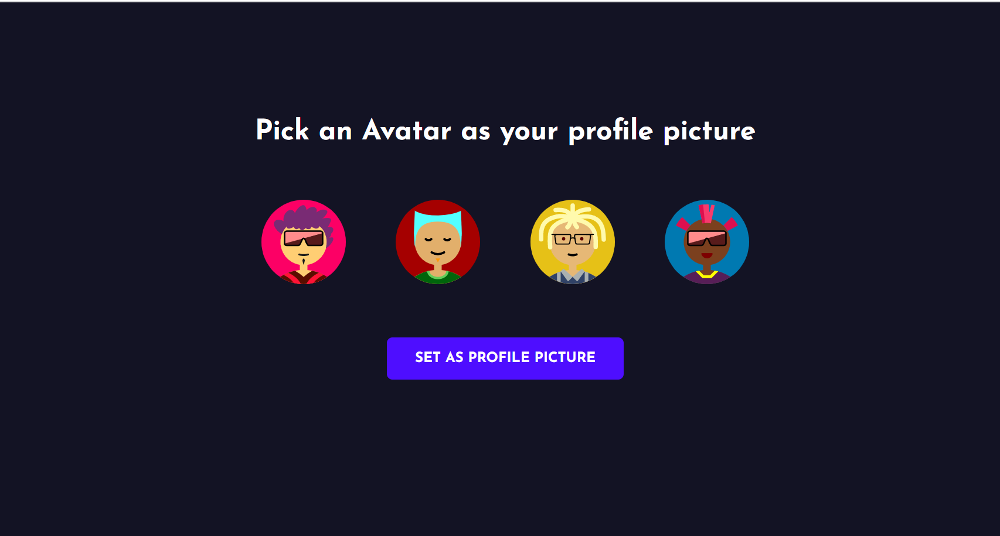
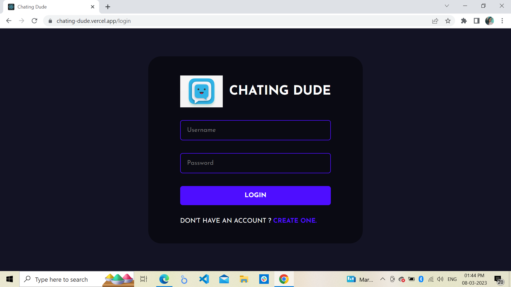
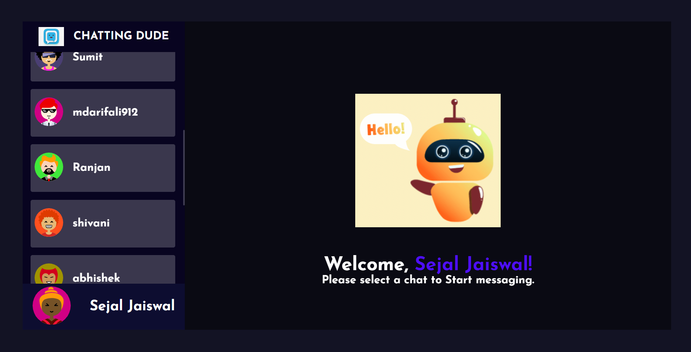

<h1 color="red" fontSize="30px"> Chating Dude  </h1>

<h3> Create Account </h3>

<h3> Avtart </h3>

<h3>Login</h3>

<h3>Welcome</h3>

<h3> Chat </h3>

<h4>install some packeges in server -- </h4>

- express | mongoose | nodemon | socket.io | bcrypt | dotenv | cors |

<h4>install some packeges in chat -- </h4>

- axios | styled-components | react-router-dom | react-toastify | uuid | emoji-picker-react

<h3> Deploy on Render </h3>
- https://chating-dude.vercel.app/

